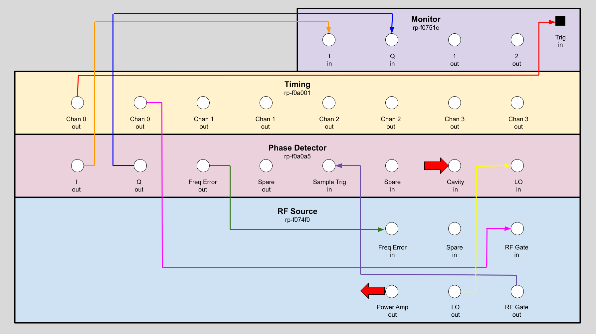
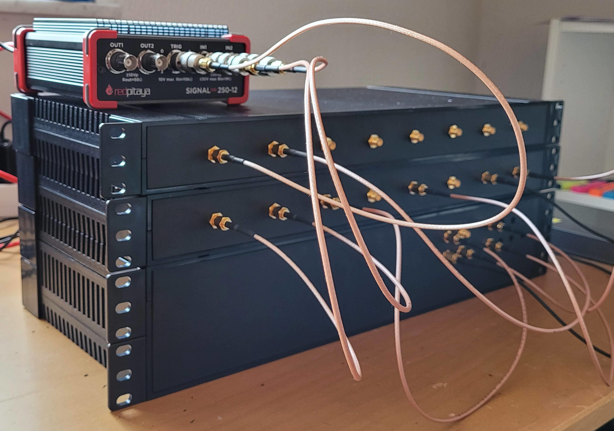

# Mirrotron Control System

* <a href="https://github.com/bl-mirrotron" target="_blank">Source code</a>

## Repositories
* <a href="https://docs.bl-mirrotron.com/mirrotron-user-guide/">Mirrotron Users guide</a>
* <a href="https://docs.bl-mirrotron.com/mirrotron-box/">Mirrotron Application Server</a>
* <a href="https://docs.bl-mirrotron.com/mirrotron-rf-src-tray/">RF Frequency Source</a>
* <a href="https://docs.bl-mirrotron.com/mirrotron-phase-detector-tray/">Four Quadrant IQ Phase Detector</a>
* <a href="https://docs.bl-mirrotron.com/gateGen125-tray/">Timing Gate Generator</a>
* <a href="https://docs.bl-mirrotron.com/mirrotron-rfq-llrf-timer-cube/">RFQ LLRF Timer Cube</a>
* <a href="https://docs.bl-mirrotron.com/mirrotron-llrf-scope-tray/">IQ Monitor System</a>
* <a href="https://docs.bl-mirrotron.com/mirrotron-rfpower-scope-tray/">RF Power Monitor System</a>
* <a href="https://docs.bl-mirrotron.com/mirrotron-rfq-temp-cube/">RFQ Temperature Cube</a>
* <a href="https://docs.bl-mirrotron.com/mirrotron-rfq-temp-tray-inlet/">RFQ Inlet Temperature Tray</a>
* <a href="https://docs.bl-mirrotron.com/mirrotron-rfq-temp-tray-outlet/">RFQ Outlet Temperature Tray</a>
* <a href="https://docs.bl-mirrotron.com/mirrotron-rfq-flow-cube/">RFQ Flow Cube</a>
* <a href="https://docs.bl-mirrotron.com/mirrotron-rfq-flow-tray-inlet/">RFQ Inlet Flow Tray</a>
* <a href="https://docs.bl-mirrotron.com/mirrotron-rfq-flow-tray-outlet/">RFQ Outlet Flow Tray</a>

## Overview
The Mirrotron Radio Frequency Quadrupole (RFQ) is part of a compact neutron source that is being built in Martonvásár Hungary. The compact neutron source consists of five major systems
* 35 keV Hydrogen Ion source
* 2.5 MeV RFQ
* Lithium Target station
* Neutron Instrument stations

The 2.5 MeV RFQ designed and built by Time Co, Ltd., Japan is a pulsed accelerator that can support 1.25 mS pulses at a rate of 40 Hz for a maximum duty factor of 5% . The RFQ can accelerate a peak beam current of 20 mA with an input RF power 260 kW at 200 MHz. providing an average beam power of 2.5 kW. The loaded cavity Q is 10,000 which results in a cavity bandwidth of 20 kHz.

The RFQ accelerator system can be divided into 6 major subsystems
* [RF source (LLRF)](#rf-source)
* [Timing system](#timing-system)
* 200 MHz RF power amplifier
* Vacuum system
* [Cooling system](#cooling-system)
* [Machine protection system](#machine-protection-system)

## RF source
The RF source is a modular system based on the Red-Pitaya Stemlab 125-14 reconfigurable instrument platform. A modular approach was chosen for design simplicity and future upgrades. Likewise, the Red-Pitaya Stemlab 125-14 was chosen for its ease of use. A block diagram is shown in Figure 1. The LLRF system comprises of four modules:
- <a href="https://docs.bl-mirrotron.com/mirrotron-rf-src-tray/">RF Frequency Source</a>
- <a href="https://docs.bl-mirrotron.com/mirrotron-phase-detector-tray/">Four Quadrant IQ Phase Detector</a>
- <a href="https://docs.bl-mirrotron.com/mirrotron-llrf-scope-tray/">IQ Monitor System</a>
- <a href="https://docs.bl-mirrotron.com/mirrotron-rfpower-scope-tray/">RF Power Monitor System</a>

Figure 1.  Block diagram of LLRF

 

Figure 2.  LLRF modules Implementation

 

## Timing system
The Mirrotron RFQ is a pulsed system so a timing system is required. The <a href="https://docs.bl-mirrotron.com/gateGen125-tray/">Mirrotron Timing system</a> is an 8 channel system based on a 32 bit counter clocked at 125 MHz. The resolution of the timing system is 8nS and can have intervals as long as 17 seconds. The implementation is shown in FigureXXX.

#### Channel allocation
The Mirrotron RFQ uses five of the eight channels:
* <ins>Channel 0</ins>  for the RF source and phase Detector
* <ins>Channel 1</ins>  for LLRF scope
* <ins>Channel 2</ins>  for the RF Power Amp pulse gate
* <ins>Channel 3</ins>  for the RF Power Amp sample and hold
* <ins>Channel 4</ins>  for the RF Power Amp Scope

#### Easy Setup Timer
These channels can be configured with the Timing App as shown in Figure 30. To change the pulse length of the RFQ, all five channels would need to be adjusted which would be time consuming and error prone. To make it easier to change the pulse length a virtual tray called the Easy Setup Timer was created. This virtual tray will adjust all five channels synchronously. This virtual device is implemented in the <a href="https://docs.bl-mirrotron.com/mirrotron-box">Mirrotron application server</a>.

FigureXXX.  Gate Generator Implementation

 

## 200 MHz RF power amplifier
more to come

## Cooling system
The RFQ will dissipate energy at an average rate of 15kW when running at peak RF power and  5% duty factor. To keep the remove this energy, two water chillers supply cooling water to the upstream (inlet) and downstream (outlet) ends of the RFQ.  The cooling water flows into headers that split the cooling to various cooling channels built into the RFQ. Control of the water chillers is manual and not part of the control system.

However to ensure that water is flowing at the correct flow rate and temperature, a separate temperature monitor and flow monitor is mounted on each cooling channel on each header as shown in FigureXXX. On top of each header, as shown in FigureXXX,  are mounted custom built Blinky-LiteTM trays that measure and report the temperature and flow through each cooling channel to the control system.

Details about the cooling monitor system software and electronics can be found at:
* <a href="https://docs.bl-mirrotron.com/mirrotron-rfq-temp-tray-inlet/">Inlet temperature tray</a>
* <a href="https://docs.bl-mirrotron.com/mirrotron-rfq-flow-tray-inlet/">Inlet flow tray</a>
* <a href="https://docs.bl-mirrotron.com/mirrotron-rfq-temp-tray-outlet/">Outlet temperature tray</a>
* <a href="https://docs.bl-mirrotron.com/mirrotron-rfq-flow-tray-outlet/">Outlet flow tray</a>

FigureXXX.  Cooling System Header

 

FigureXXX.  Outlet Cooling System Header From left to right: Temperature cube and tray, 5V power, 24V power, Flow cube and tray

 

## Machine protection system
More to come
